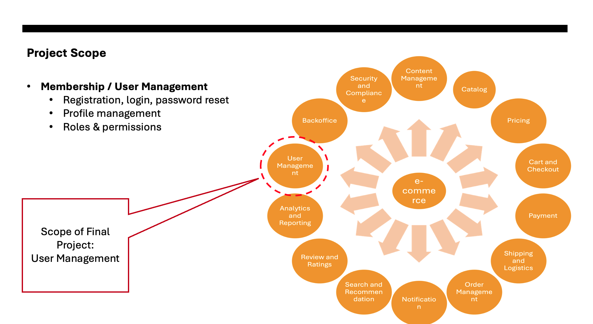

# Domain
  - E-Commerce

# Project Scope

# Problem Statement

# User Stories

# Analysis

Use Cases 

# Design 

Class Diagram

ERD

# Tech Stack

# Architecture Diagram

# Postman
Environmental Variables in Postman

Register New User

Log in

Profile Update:

Pagination

# Database 
Password is encrypted

Created Profiles

# AWS Deployment

